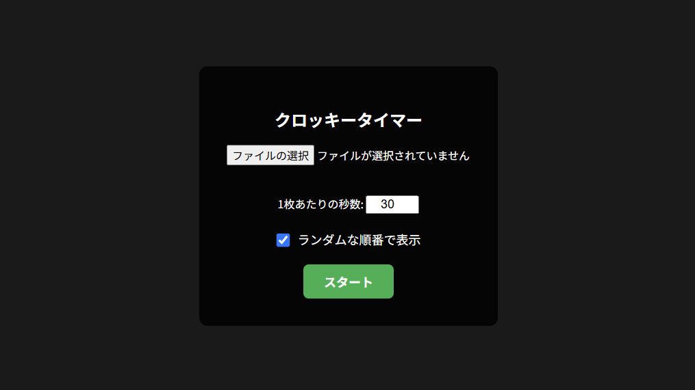
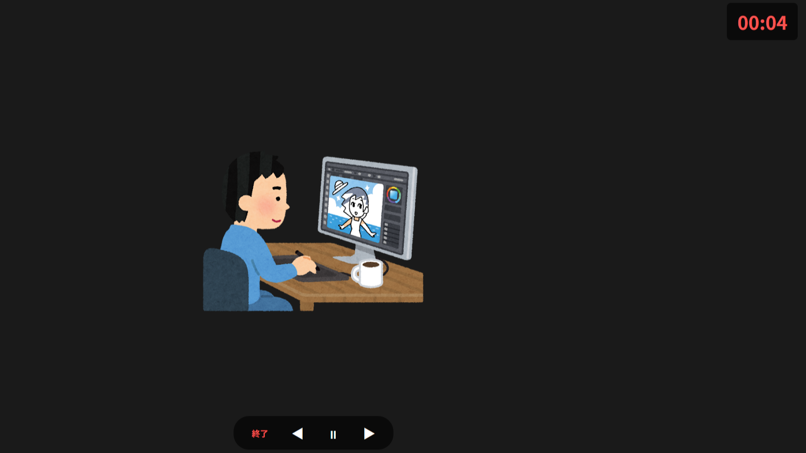

> 画像のアップロード不要！完全ローカルで動作するシンプルな自作クロッキータイマーを紹介します。

## はじめに

皆さんは普段、どのように絵の練習をしていますか？

対象を短い時間で素早く捉えて描く **ジェスチャードローイング** や **クロッキー** は、画力向上のための非常に効果的なトレーニングとして知られています。
その練習をサポートする素晴らしいツールとして、[Line of Action](https://line-of-action.com/) のような有名なWebサイトを使ったことがある方も多いのではないでしょうか。

私も日々の練習でお世話になっているのですが、長く続けているうちに **「こんなクロッキータイマーが欲しい」** という理想の条件がいくつか出てきました。

* **使い慣れたLine of Actionのような使い勝手でクロッキーしたい**
* **練習効率を高めるため、クロッキー対象の画像を自分で自由にカスタマイズしたい**
* **著作権と処理速度の観点から、ローカル画像を外部サーバーにアップロードしたくない**

特に3つ目の「画像のアップロード」は大きな壁でした。手元にある画集の模写や、自分で集めたリファレンス画像を使いたいとき、いちいち外部のサーバーに送信するのは少し抵抗がありますよね。

そこで今回、これらの要望をすべて満たす、完全オフライン動作の自作クロッキータイマー **「Local Croquis Timer」** を作成しました！

まずは、完成したアプリを直接触ってみてください。

* **▶ デモを試す:** [Local Croquis Timer (GitHub Pages)](https://tademushi2004.github.io/local-croquis-timer/)
* **▶ ソースコード:** [GitHubリポジトリ](https://github.com/tademushi2004/local-croquis-timer)

---

## 概要と使い方（機能デモ）

**Local Croquis Timer** は、ブラウザさえあれば **手元のPC内で完全に完結する** タイマーアプリです。
どのような機能があり、どうやって使うのか、実際の画面（スクリーンショット）と一緒にご紹介します。

### 1. 初期画面でのセットアップ（画像の読み込みと設定）

使い方はとても簡単です。本アプリは以下の2種類の方法でご利用いただけます。

1. **GitHub Pagesのリンクから直接開く**
   [デモページ](https://tademushi2004.github.io/local-croquis-timer/) にアクセスするだけで、すぐにブラウザ上で動作します。
2. **`index.html` をローカルにダウンロードして開く（推奨）**
   [リポジトリ](https://github.com/tademushi2004/local-croquis-timer) から `index.html` を手元にダウンロードし、ダブルクリックしてブラウザで開きます。**一度ダウンロードすれば以降はインターネット環境すら不要になり、日常的な運用が最も簡単になるため、こちらの方法を強く推奨します！**

どちらの方法でもサーバーとの通信は一切行わないため、画像のアップロードやセキュリティの心配なく安心してお使いいただけます。画面が開いたら「ファイルを選択」ボタン、または画面へのドラッグ＆ドロップで、練習に使いたい画像をまとめて読み込ませます。

**【おすすめの運用方法】**
あらかじめ練習用のローカル画像をひとつのフォルダにまとめておき、ファイル選択ダイアログが開いたら `Ctrl + A`（Macの場合は `Cmd + A`）で全選択して一気に入れるのがおすすめです！

また、画力向上のための「意図的な練習（Deliberate Practice）」において、次に何が表示されるか予測させないことはとても重要です。
初期画面の **「ランダムな順番で表示」** にチェックを入れておくと、画像がシャッフルされて表示されます。これにより、脳に適切な負荷（インターリービング）をかけながらクロッキーを行うことができます。

### 2. クロッキー実行中の画面（ノイズレスUIと操作性）

練習中は、画面右上に半透明のタイマーが常駐します。
画面の下部や端を余計なUIで隠さないため、描くことだけに集中できる **ノイズレスな環境** を実現しています。

また、残り時間が5秒を切るとタイマーの文字が赤くなり、1秒ごとに小さな警告音が鳴る機能も搭載。画面から目を離して手元の紙を見ていても、切り替わりのタイミングを逃しません。

さらに、画面下部には画像送りや一時停止を行うための目立たない半透明のボタン（◀ ⏸ ▶ 終了）が配置されており、マウスやペンで直接クリックして操作することが可能です。

ペンを持ったままもう片方の手でサクサク操作できるように、便利なキーボードショートカットにも対応しています。

* `Space`: 一時停止 / 再生
* `→` / `←`: 前後の画像へ移動
* `Esc`: タイマーを終了

---

## 使用した技術

今回のアプリは、特別なフレームワークを使わず **HTML / CSS / Vanilla JavaScript** を1つのファイル（`index.html`）にまとめた非常にシンプルな構成で作成しています。この構成にしたのには、いくつかこだわりの理由があります。

**1. File APIによる完全ローカル処理**
画像の読み込みにはJavaScriptの `URL.createObjectURL()` を活用しています。これにより、ユーザーが選択した画像を外部のバックエンドサーバーにアップロードすることなく、ブラウザのメモリ上だけで直接表示させることができます。余計な通信が発生しないため、数百枚の画像を選択しても一瞬で読み込みが完了します。

**2. AudioContextを使ったシンセサイザー音**
タイマーの警告音や終了音を鳴らすために、外部の音声ファイル（mp3など）を読み込むのではなく、Web Audio APIの `AudioContext` を使ってブラウザ上で直接音（サイン波）を生成しています。これにより「音声ファイルへのリンク切れ」という概念がなくなり、真の意味で `index.html` 単体で完結するアプリになりました。

**3. 環境構築ゼロのポータビリティ**
Node.jsやビルドツール（WebpackやViteなど）への依存関係を一切排除しました。そのため、誰でもリポジトリから `index.html` をダウンロードしてダブルクリックするだけで、すぐに使い始めることができます。この「身軽さ」が最大のメリットです。

---

## おわりに

自分のお気に入りの画像を詰め込んだフォルダを使って、安全かつ手軽にクロッキーができる環境が整いました。
もし「ローカル画像でクロッキーしたいけど、ちょうどいいタイマーが見つからない」という方がいれば、ぜひこのアプリを活用してみてください！

* **▶ デモを試す:** [Local Croquis Timer (GitHub Pages)](https://tademushi2004.github.io/local-croquis-timer/)
* **▶ リポジトリはこちら:** [tademushi2004/local-croquis-timer](https://github.com/tademushi2004/local-croquis-timer)

一緒に画力向上を目指して頑張りましょう！

> 【免責事項】本記事で紹介しているアプリは個人開発のオープンソースソフトウェアです。本アプリの利用により生じたいかなる損害についても、作者は責任を負いかねます。ご自身の判断と責任にてご利用ください。
